# MicroDexed User Manual

written by Holger Wirtz and Thierry Pottier

Version 1.1 (July 2020)

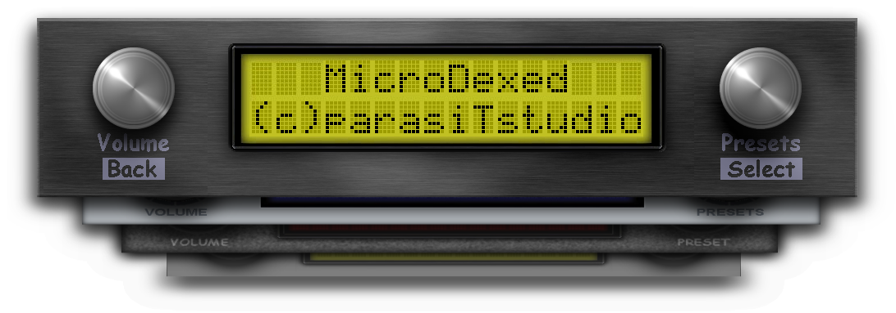

## What is MicroDexed?

MicroDexed (from now called MD) is a FM-(Software-)Synthesizer with six operators and much additional features (like effects and a some extensions). It is written in C/C++ for the microcontroller Teensy-3.6/4.x. The sound generation (msfa) from the free VST-plugin [Dexed](https://github.com/asb2m10/dexed) was used and a user interface was created using two encoders and a LCD display. It is controlled via MIDI (you need a keyboard) and voice presets can also be programmed via MIDI.

For the original Dexed/msfa software take a look at [Dexed on Github](https://github.com/asb2m10/dexed) and
[Music Synthesizer for Android on Github](https://github.com/google/music-synthesizer-for-android).

## Features

* Compatible to a legendary FM synth with six operators from a famous Japanese manufacturer
* MIDI interface:
	* DIN IN/OUT with software THRU (can be disabled, optional hardware THRU possible)
	* USB-Slave (for connecting to a PC)
	* USB-Master (for connecting keyboards)
* Audio interface:
	* RCA stereo IN/OUT with audio THRU (daisy-chain your sound generators (adds a little bit of noise))
* Onboard effects:
	* Chorus (mono)
	* Delay (mono, up to 500ms, with feedback)
	* Low-pass filter with resonance
	* Reverb (stereo)
	* Resonant low-pass filter
* Mono sound engine with panorama controller before reverb
* Up to 20 voices of polyphony
* Up to 100 banks of 32 voices can be stored on an SD card
* MIDI SYSEX compatible
	* Sounds can be edited with external editors like...
		* [EdiSyn](https://github.com/eclab/edisyn)
		* [Dexed-VST](https://asb2m10.github.io/dexed/)
		* [DX7 by Vstforx](https://dx7.vstforx.de/)
		* [Synthmata](https://synthmata.com/volca-fm/)
		* [KI generated DX banks](https://www.thisdx7cartdoesnotexist.com/)
	* Sending of Voice/Bank MIDI-SYSEX dumps
	* Receiving of Voice/Bank MIDI-SYSEX dumps
	* Voice-Parameter change via MIDI-SYSEX
	* Flexible MIDI controller settings with additional features
	* Modwheel, Pitchbend, Portamento, Breath-Controller, Aftertouch, Foot-Controller
	* Additional modes for most controllers (linear, inverse, direct)
	* Controller parameter change via MIDI-SYSEX
	* Additional MIDI-CCs
		* Bank select
		* Preset select
		* Volume
		* Panorama
		* Filter resonance
		* Filter cutoff
		* Delay time
		* Delay feedback
		* Delay volume
* Storage of voice presets, effect presets and combinations of both as "performance" on SD card
* Transpose, fine-tune, mono-mode
* Note refresh options: normal or retriggered
* Velocity level adaption 
* Three sound engines:
	* Modern : this is the original 24-bit music-synthesizer-for-android implementation.
	* Mark I : Based on the OPL Series but at a higher resolution (LUT are 10-bits). The target of this engine is to be closest to the real DX7.
	* OPL Series : this is an experimental implementation of the reverse-engineered OPL family chips, 8-bit. Keep in mind that the envelopes still need tuning.
* Open-Source (https://codeberg.org/dcoredump/MicroDexed)

## Requirements

To use MD, you need suitable hardware. For example [TeensyMIDIAudo (TMA)](https://codeberg.org/dcoredump/TeensyMIDIAudio/src/branch/master/Rev-1.8) was developed directly for MD. The schematics and layouts are open-source, so you can easily build a TMA board. You can also build it on a stripe grid board or use completely different variants - it's up to you how you build the hardware. Another option (with a few extensions) is the [Teensy Guitar Audio Shield](http://blackaddr.com/products/).

Basically your MD "board" needs the following:
* I2C connector for connecting an LCD display (software is written for a 2x16 character display, but a bigger one should do also).
* 2 rotary encoders (for each encoder one digital input for the button and two digital inputs for the encoder directions).
* A DA converter supported by Teensy (something like an "audio shield", e.g. the Teeensy audio shield, or (the simplest way) you can use the 12bit DA output pins of the Teensy-3.6 (not possible for Teensy-4.x!)). Audio output is also possible via the USB-B port directly into a PC and some recording software (like Audacity).
* Getting MIDI into the Teensy
  * via the onboard Micro-USB port (or USB-B port on a TMA board (note: will not work for USB-MIDI-keybords, because it is not a host port!))
  * via USB-Host port (with soldering a header on the Teensy-3.6/-4.1)
  * via external IO-components for DIN-MIDI.
* A small FAT32 formatted SD card.
* The Arduino IDE and TeensyDuino for compiling and uploading the program code (tested with Arduino-1.8.12 and TeensyDuino-1.52).

The complete hardware build manual for the TMA board can be found inside the [TMA-Build-Manual](https://codeberg.org/dcoredump/TeensyMIDIAudio/src/branch/master/Rev-1.8/Build-Manual/TMA-Build-Manual.pdf). So for now we expect that you have a running hardware with installed MD software.

## Front Panel Controls

The normal controls for the user are arranged as follows:

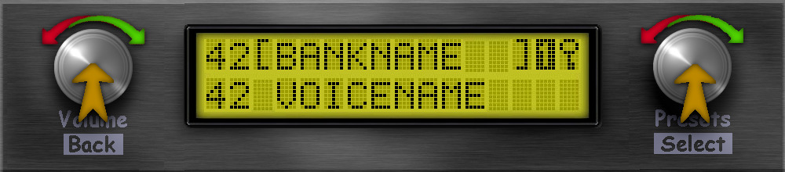

If you decide to do the arrangement differently this is no problem. You only have to remember how the encoders are assigned to the function:

* Left encoder is named __VOLUME__
* Right encoder is named __PRESET__

### Permament Encoder Functions

The __VOLUME__ encoder will always have the following functions - no matter where you are in the menus:
* __Turn left/right__: Change the volume (MIDI-CC 7). The volume change screen appears when turning the knob and disappears after a short time and you return where you left off.
* __Long-Press__: A MIDI panic is triggered and all voices are muted.
* __Short-Press__: Go back, from the selected menu item or up to the parent menu.
  
The __PRESET__ encoder only has two different permanent functions:
* __Long-Press__ inside menu: go to the sound/bank selection.
* __Long-Press__ inside voice/bank selection: switch between voice and bank selection.

## Quick start

On a freshly installed MD the screen should greet you with the sound/bank selection. The volume is set to 80%.

__Long-Press PRESET__: Switch between voice and bank selection:

 
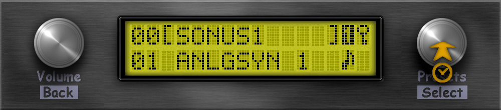

 __Turn PRESET left/right__: Change voice or bank (voices: 1-32, banks: 0-99):

 

-  indicates that you are using timbre 1.
-  indicates that you currently use the monotimbral engine.
-  are showing which parameter you are currently editing with the __PRESET__ encoder.
-  below the timbre symbol(s) indicates that there was a MIDI event. If you are using a Teensy -4.x different height bars (depending on velocity) are displayed per timbre.

## Using MicroDexed

The individual menu items are described below. MD knows three different states:

* Voice/Bank selection
* Adjust volume
* Menu

After turning MD on, you are in the voice/bank selection. To enter the menu press the volume encoder. You can return to the voice/bank selection by holding down the preset encoder. If you turn the volume encoder, the volume screen appears and you can see which value is set. After a few seconds the system automatically returns to the previous screen.

To select items in the menu, turn the preset encoder. On the right side you will see where you are in the menu list. You can select a menu item or jump to a submenu by pressing the preset encoder.

If you want to leave a parameter edit or go up one level in the menu, press the volume encoder.

---
> __Hint__:
> You can compile MD with several different options and accordingly some features may or may not be available. This also depends on what kind of microcontroller you use. In this manual the standard options are used:
> 
> * Microcontroller: Teensy-3.6 (240 Mhz overclocking)
> * Teensy audio card (SGTL5000 based audio chip)
> * USB-host port enabled
> * *Mono-timbral* engine
  ---

If you use the *dual-timbral* engine, in many menus a small  will appear (right of the ) instead of the key. To switch between the two engines and change their parameters, simply press the preset encoder.

---
> __Hint__:
> MD stores settings in the internal EEPROM. These changes will survive a power loss. __However, the changed values are only written into the EEPROM when the menu is exited by pressing the volume encoder (BACK)!__
---

### Sound/Bank selection

The most important screen will be the sound selection. The screen displays the selected bank number (top left) and the selected voice number (below). Next to the numbers are the corresponding preset names. The active paramater (marked with square brackets) can be changed by turning the preset encoder.

MD can manage 100 banks (0-99) and 32 voices per bank. If you turn the preset encoder farther than the 32nd voice of a bank, the first voice of the next bank will be loaded automatically, except if you already reached the last bank (bank 99). This happens the same way if you try to go lower than voice number 1.

 
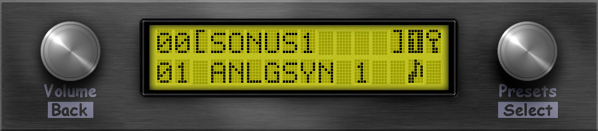

To switch between voice and bank selection, the preset encoder must be long-pressed.

Next to the bank name is the symbol for the active engine. As described above, we use the *mono-timbral* engine for this manual, so the character next to  shows a key symbol and is therefore not available. In this case you can't switch between the two instances by pressing the preset encoder.

If one or several MIDI note events are detected, a note symbol is displayed below the corresponding instance as long as this note is active.

When the voice is changed, MD sends a voice dump in the background via MIDI SYSEX on its selected MIDI channel. This has the advantage that external devices (like a voice editor on a PC) synchronize the data directly.

To enter the menus, press the volume encoder.

### Voice Menu

The Voice menu is the most comprehensive menu. Here all functions related to sound generation are available in submenus. 

#### Audio Menu

The audio submenu contains all functions that can lead to audible changes in any form.

##### Voice Level

 
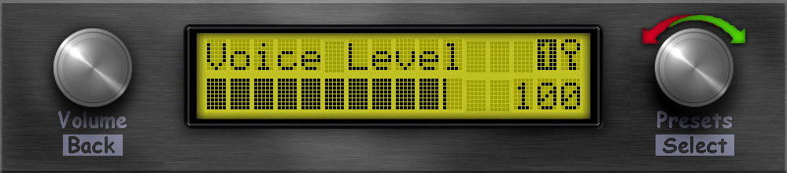

By changing (and later saving) this value you can compensate for differences in volume between different sounds. The value ranges from 0 to 127. Default is 100, but you can make the sound louder by increasing the value.

##### Panorama

 
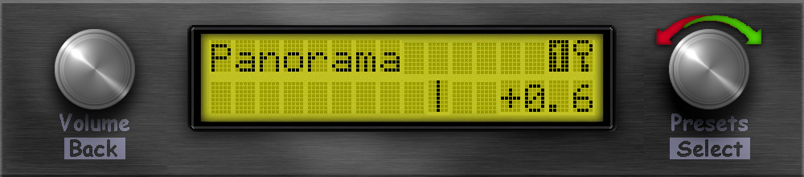

The voice's position in the stereo image can be adjusted here (MIDI-CC 10).

##### Effects

MD comes with some effects. Basically, each MD instance has its own resonant low-pass filter, (mono) Chorus and a separate (mono) delay (500 ms for mono-timbral / 250ms for bi-timbral). This is followed by the position in the stereo image (see panorama) and a stereo reverb. A complete picture of the generation of the audio signal is stored in the [Repository](https://codeberg.org/dcoredump/MicroDexed/src/branch/master/doc/MicroDexed-Audio-FlowChart.png).

---
> __Note on effects menu:__
> It is possible to deactivate the effects at compile time. If this was done, then the effects menu is not available!
---

###### (Mono-)Chorus

This simple chorus is generated by mixing the original signal and a pitch-modulated copy. The effect is only audible when frequency, depth and level are all somehow greater than 0.

Parameters:
* Frequency (0-10 Hz)
* Waveform (Triangle/Sine)
* Depth (0-100)
* Level (0-100)

###### (Mono-)Delay

The delay has a feedback loop and can be mixed into the original signal by means of level. Therefore time and level must be greater than 0.

Parameters:
* Time: (0-500ms for *mono-timbral* or 0-250 for *dual-timbral* (on Teensy-3.6))
* Feedback (0-100)
* Level (0-100)
  
> Dedicated MIDI controller numbers:
> * Time: MIDI-CC 105
> * Feedback: MIDI-CC 106
> * Level: MIDI-CC 107

###### Filter

The filter is a resonant 4-pole low-pass filter.

Parameters:
* Cutoff (0-100)
* Resonance (0-100)
  
> Dedicated MIDI controller numbers:
> * Cutoff: MIDI-CC 104
> * Resonance: MIDI-CC 103
  
###### (Stereo) Reverb (Master effect)

The reverb is a port of freeverb. With the *mono-timbral* engine the parameter *Reverb Send* seems to be superfluous and can be set to 100. But if you use the *dual-timbral* version, you can set the amount of reverb send for each of the two sound generators separately. The reverb can only be heard when the roomsize and level as well as *Reverb Send* are greater than 0.

Parameters:
* Roomsize (0-100)
* Damping (0-100)
* Level (0-100)
* Reverb Send (0-100)

> Dedicated MIDI controller numbers:
> * Level: MIDI-CC 91

###### EQ (Master effect)

The EQ is only active when using a Teensy audio shield (or SGTL5000 chip). It serves as a simple adjustment of the sound image.

Parameters:
* Bass (0-100)
* Treble (0-100)

##### Controller

The controller section is responsible for the settings of the different MIDI controllers.

---
> __Note on Controllers:__
>
> How it works inside MD:
>
> Pitch and amplitude modulations are set inside the voice presets by two parameters : *PMD* (*P*itch *M*odulation *D*epth) and *AMD* (*A*mplitude *M*odulation *D*epth)
>
> These settings cannot be edited using MD's interface (but can be edited via MIDI-SYSEX).
>
>---
> Pitch modulation:
>
> The LFO, internal to MD, will affect all operators in the same way. Its frequency (or rate) and depth are common to all operators.
>
> Depending on the LFO's waveform, the effect will sound like a faint vibrato or a large wobble (sine or triangle), a trill (square), a series of random pitches (sample and hold), to name a few.
>
>---
> Amplitude modulation:
>
> The LFO, internal to MD, will affect all operators independently: Rate will be common, but modulation depth can be set differently on each operator.
>
> If the operator is a carrier, the LFO will affect the general volume of the preset. A sine wave LFO applied to a carrier operator will result in some kind of tremolo effect.
>
> If the operator is a modulator, the LFO will affect the harmonic content of the preset. A sine wave LFO applied to a modulator operator can, in most cases, be compared to an automatic Wah-Wah effect. A sample and hold LFO applied to a modulator operator will result in a series of notes with random brightness.
>
>---
> MD's controller menu
>
> Even if pitch and amplitude modulations are already set inside the Dexed preset, it is still possible to add modulation using external controllers.
>
> Controllers are physical or virtual devices, external to MD, which will have an effect on some parameters via MIDI-CC messages.
>
> On MD, sources are : Pitch Bend, Modulation, Breath Controller, Foot Pedal, Aftertouch.
>
> Destinations are: pitch modulation by internal LFO, amplitude modulation by internal LFO, EG Bias.
>
> On a physical synth or master keyboard, pitch bend is usually controlled by a wheel or one axis of a joystick, modulation by a second wheel, or the second axis of the joystick, a breath controller by an external pressure sensor, and foot pedal is obvious.
>
> But in fact, if this is a common setting, other combinations can occur, depending on the keyboard/controller and of the musician's choice.
>
> Controller MIDI messages can as well be produced by virtual controllers as DAWs, virtual keyboards or MIDI command software.
>
> The devices named in this manual refer to the MIDI message, no matter what kind of controller device produces them.
>
> MD will not produce any MIDI CC messages, but will define their destination, their operating mode, and their intensity.
---

###### Pitchbend

The pitch of a note can be raised or lowered using the Pitch Bend control, which is usually a dedicated wheel or joystick on a master keyboard. The range can be set up to one octave on both directions (up/down). *Range* setting defines the highest possible variation: from one semitone to a full octave.
*Steps* define if the control is continuous (step = 0) or uses discrete values (steps) of 1, 2 ... 12 semitones.

Parameters:
* Range (0-12)
* Step (0-12)

###### Other controllers (Modulation-Wheel/Aftertouch/Foot-Contoller/Breath-Controller)

Other MIDI controllers all have the same modification possibilities. The output of modulation can affect different destinations: PITCH (pitch envelope), AMP (loudness envelope), EG (see note below). It is possible to specify targets or any combination of targets. In order to hear an effect, the voice preset must be configured accordingly.

---
> __Note on controllers:__
>
> External controllers such as Mod Wheel, Foot Pedal, etc, will send MIDI messages to MD, from 0 to 127.
>
> * The *Assign* parameter will define the destination of this modulation.
> * The *Range* parameter will define a divider, reducing this operating range to fit the user's needs (*Range* can be seen as a percentage value).
> * The *Mode* parameter will define the behaviour of the controller's output, or how MD will react to the controller's messages.
>
> In *Linear* mode, the modulation applied to the chosen destination will vary from 0 to the value defined by *Range*.
> Output can be considered as:
>
> > MIDI CC value * (*Range*/100) (not inverted)
>
> In *Reverse* mode, the MIDI CC value is substracted to its maximum. The output will vary from 127 to (127-*Range*), and thus will be inverted, compared to its input.
> Output can be considered as:
>
> > 127 - (MIDI CC value * (*Range*/100))
>
> In *Direct* mode, the modulation applied to the chosen destination will vary from (127-*Range*) to 127, without being inverted.
> Output can be considered as:
>
> > 127 - ((*Range*/100)*127) + (MIDI CC value * (*Range*/100))
>
> *Linear* will be preferred for Pitch or Amp modulations (no modulation when MIDI CC's value is null, maximum modulation set by the *Range* parameter).
>
> *Direct* mode will be preferred when modulation is applied to EG bias: MIDI CC value of 127 (maximum) will leave the sound unaltered, while lower values will reduce the volume or brightness of the preset, down to a value defined by *Range*.
>
> *Reverse* mode will be used for example when one controller is applied to two different MD units (or two instances of a bitimbral MD), set to the same MIDI channel, to modify the level balance of those two engines. If one of the MDs is set to Direct and the other to Reversed, it will then be possible to control the balance of those two engines, for example by turning the Mod Wheel or by pressing the Foot Pedal, allowing some kind of sound morphing.
>
> 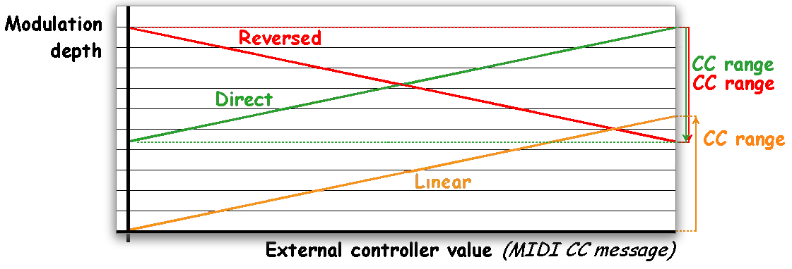
---

Parameters:
* Range (0-99)
* Assign (PITCH/AMP/EG or any combination)
* Mode (LINEAR/REVERSE-LINEAR/DIRECT)

> Dedicated MIDI controller numbers:
> * Modulation wheel: MIDI-CC 1
> * Foot contoller: MIDI-CC 4
> * Breath controller: MIDI-CC 2

---
> __Note on target EG:__
>
> Each of the 6 operators has similar settings, no matter if it is a carrier or a modulator.
>
> Among those settings are an envelope generator and an output level.
>
> Output level could as well be called "Gain" and can be compared to a mixer entry fader (in case of a carrier) or a modulation index (in case of a modulator).
>
> EG stands for EG bias, and could as well be called EG depth. It could be compared to the filter's EG depth on an analog synthesizer.
>
> When a controller is routed to EG (aka EG Bias), the *Range* value will define how much the controller will affect each operator's envelope depth.
>
> Depending on a parameter which is internal to the sound engine's preset, this will have a different effect and in many cases no effect at all.
>
> On MD, this internal parameter is called *AMD* (for *A*mplitude *M*odulation *D*epth) and the controller routed to EG will only have an effect on the operators when their individual *AMD* is set to a value greater than 0.
>
> If those operators are carriers, the controller routed to EG will control the overall volume of the sound.
>
> If those operators are modulators, the controller routed to EG will affect the modulation indexes, which have an effect on the harmonic content of the sound (the higher the modulator's level, the richer the harmonics, leading to a brighter sound).
>
> If carriers and modulators have an *AMD* setting with a value greater than 0, then the controller routed to EG will affect, at the same time, volume and brightness of the sound.
>
> If no operator has an *AMD* setting greater than 0, then the controller will have no effect.
>
> In short: If, inside the preset, *AMD* is set to 0 for all operators, then the controller will have no effect.
>
> 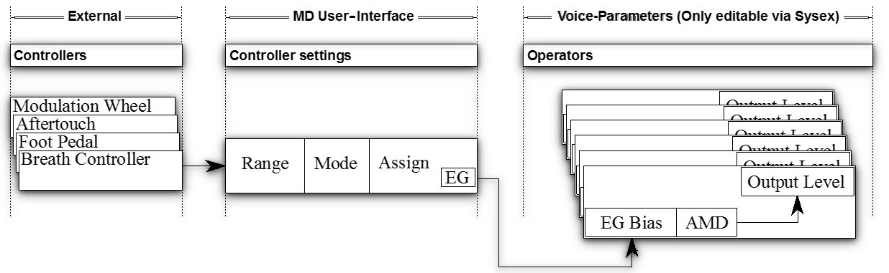
>
>> __Note on changing *AMD*:__
>> You can easily change all voice parameters by using an external MIDI-SYSEX editor (see Appendix).
---

##### MIDI

In this menu everything concerning MIDI control is set.

###### MIDI Channel

This parameter sets the MIDI receive channel. MD will react to messages coming from this channel. A channel between 1 and 16 can be selected. Alternatively *OMNI* can be selected if data should be received from all MIDI channels.

Parameters:
* MIDI-Channel (OMNI/1-16)

###### Lowest/Highest note

You can also restrict the range of MIDI-notes to which MD should react. This allows split and/or dual configurations with the *dual-timbral* engine.

Parameters:
* Lowest Note (A0-C8)
* Highest Note (A0-C8)
  
> __Note on ranges:__
> You have to check by yourself if the note ranges you entered make sense. If you set *Lowest Note* to C6 and *Highest Note* to C4 you won't hear anything!

###### Send voice

The currently configured voice can be sent via MIDI SYSEX, for example to edit it in an external editor or use it on another MD.

1. Choose the bank.

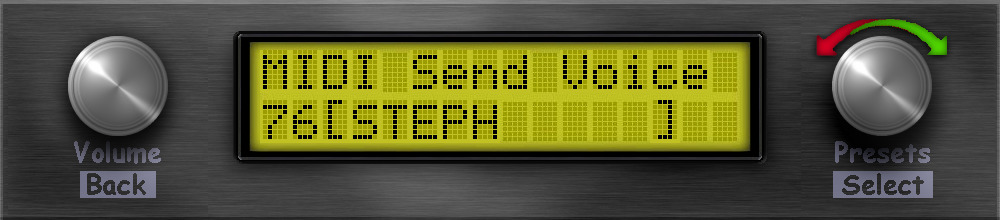

2. After choosing, push the preset encoder.

3. Choose the voice to send.

4. After choosing, push the preset encoder and the data will be sent via MIDI.

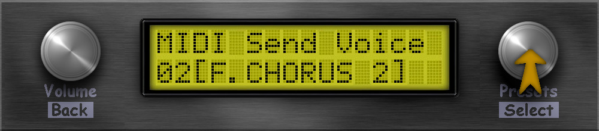

> __Note on sending voice data:__
> The voice data is sent on the current MIDI channel. If the MIDI channel is *OMNI* the data will be send on Channel 1.

#### Setup

The setup menu contains all other parameters that control this voice.

##### Portamento

Portamento allows the pitch to slide continuously from one note to the next one.

Parameters:
* Mode (FINGERED/FULL)
* Glissando (ON/OFF)
* Time (0-99)

> Dedicated MIDI controller numbers:
> * Portamento On-Off: MIDI-CC 65

---
> __Note on portamento:__
>
> Each musical instrument has a specific way to produce notes. Some have frets, keys, pistons and will produce discrete notes inside a scale. In european temperament, those notes are usually a chromatic scale (C, C#, D, D#, ...).
>
> On these instruments it is very hard or even impossible to produce a note between those of a scale. The pitch will then abruptly switch from one note to another, it will only vary by steps, and no intermediate pitch will be produced.
>
> On other instruments, such as violin or trombone, the pitch of the note can vary continuously, depending on the exact position of the finger on a string, or the length or the air column inside the pipe: This allows the pitch to slide continuously from one note to the next one. This is known as portamento.
> Depending on the instrumentalist technique, this slide can be fast or slow. On MD, this speed is defined by the *Time* parameter. Higher values for portamento rate will produce a fast slide while lower values will result in a slower slide.
>
> In monophonic setting, you can choose between a constant (*Full*) portamento (all notes are concerned) or a *Fingered* portamento, which will only happen while you keep the initial key pressed when playing a new key (legato).
>
> *Glissando* is different in that instead of producing a continuous slide between the pitches of the subsequent notes, it will play all the notes of the scale which are between those 2 notes, like a pianist gliding his finger on the keyboard, or a guitarist on his fretted guitar neck.
> A glide between C3 and E3 will play subsequently C3, C#3, D3, D#3, E3, when a portamento would result in a continuous rising of the pitch, from C3 to E3.
>
> 
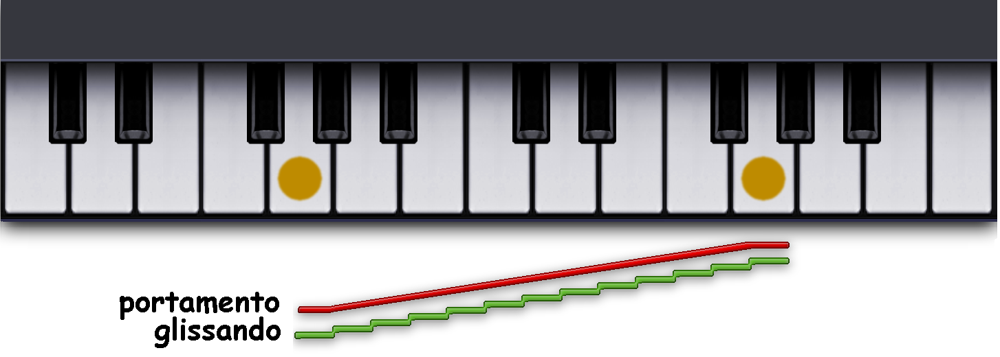

---

##### Polyphony

You can reduce the maximum number of voices played simultaneously if neccessary. If you hear glitches or gaps in sound maybe reducing the polyphony by one can help to avoid these problems.

Parameters:
* Polyphony (0-20, see note below)

---
> __Hint for *Polyphony*:__
> Maximum polyphony depends on the Teensy used and the clock speed set at compile time. Setting the polyphony to 0 means that no sound will be produced. In *Monophonic* mode you need at least a polyphony of 2.
---

##### Transpose / Fine-tune

With these parameters you can adjust the pitch. By means of *Transpose*, this is done in semitone steps (+/- 24 semitones) and by *Fine-Tune*, in +/- 99 cents.

Parameters:
* Transpose (-24 - 24)
* Fine-Tune (-99 - 99)
  
##### Mono-/Polyphonic

MD can be set to a monophonic mode. In this mode, envelopes are not restarted when playing legato. In combination with *portamento* this can lead to nice sounding effects.

Parameters:
* Mono/Poly (MONOPHONIC/POLYPHONIC)
  
---
> __Important note on *Mono/Poly*:__
> Please do not confuse this parameter with *Polyphony*! *Mono/Poly* limits the polyphony only indirectly by using only two of all available internal sound generators. If *Polyphony* is set to one, it is still different from playing with *MONOPHONIC* mode enabled. Furthermore, a polyphony of at least two is required for *MONOPHONIC* mode!
---

#### Internal

In the internal menu there are several basic items.

##### Note Refresh

With *Note Refresh* you can influence the behaviour when playing the same note.

For example: If you play a G5, press and hold the sustain pedal and play the same note again, another one of the available tone generators will be set to play the note. So the note sounds double and its envelope would also run out seperately for both notes (with a corresponding time delay). This would, however, limit the maximum available notes, since the same note sounds multiple times.

With *RETRIGGERED*, the envelope of the same note is started again and more remaining tone generators are available for other notes.

You should try out this setting and decide yourself which variant is more to your liking.

Parameters:
* Note Refresh (NORMAL/RETRIGGERED)
  
##### Velocity Level

Presets which have been programmed on some editors, like DEXED for example, may benefit from setting Velocity Level to 127. Other presets coming from other sources or editors might sound better with Velocity Level set to 100. If you have a hard to play keyboard or just want everything to sound "louder" or "more brilliant" and you don't like to press the keys so hard, you can set a higher value here.

Parameters:
* Velocity Level (100-127)

##### Engine

The original Dexed offers three different routines for generating sound, all of which sound a little different. These three engines can also be found in MD and you can try out which one sounds best in your opinion. *Mark 1* is modeled after an original FM synth (with respect to the calculation), *Modern* is more modern and more accurate and *OPL* is the attempt to recalculate the sound generation like it was done on OPL chips back then.

Parameters:
* Engine (MODERN/MARK 1/OPL)

#### Operator

Operator enable/disable is a function often used when creating sounds. As an example, let's assume that operator 2 is disabled and we want to enable it again:

The blinking cursor is on :

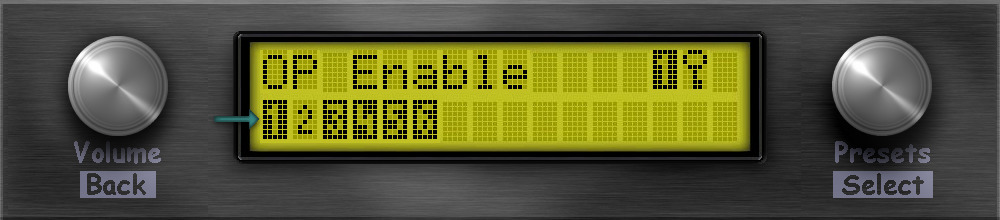

1. Choose  by turning the preset encoder to the right.

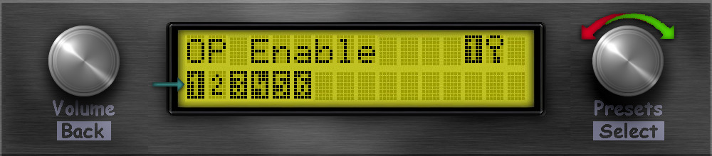

1. When the blinking cursor is on , push the preset encoder.

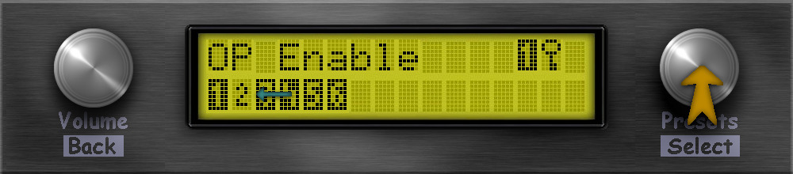

Now operator  is enabled:

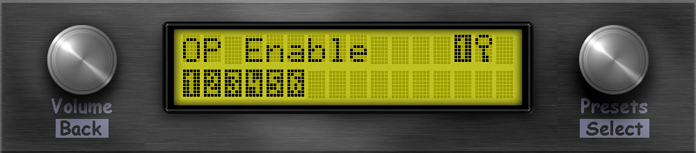

Pushing the encoder again disables the operator (). If you disable all operators (or only the carrier operators), there will be no sound output.

#### Save voice

Use this entry to store the current voice inside a bank on the SD card.

1. Choose the bank.

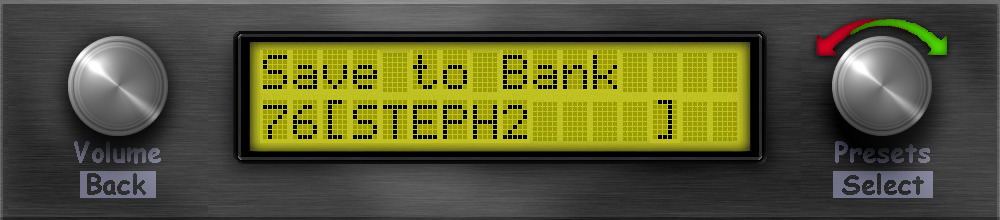

2. After choosing, push the preset encoder.

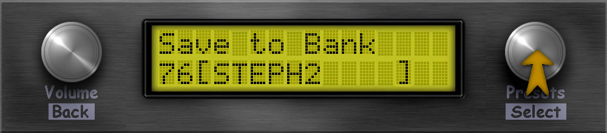

3. Choose the slot where to store the voice.

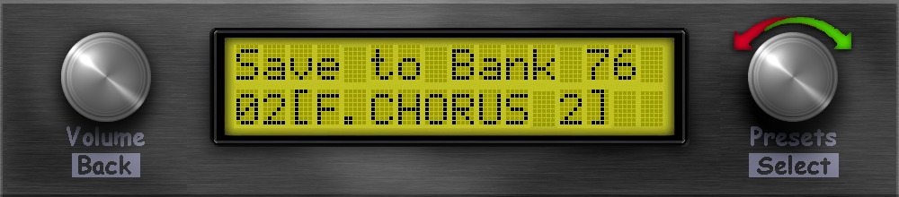

4. After choosing, push the preset encoder.

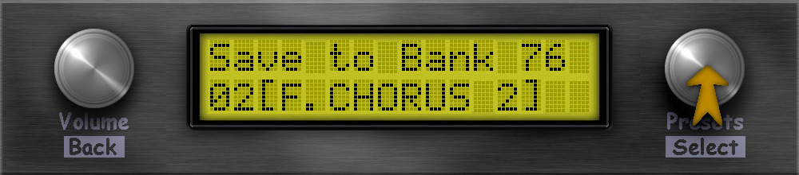

5. Want to overwrite the selected bank/voice? If yes, turn the preset encoder to choose **YES**. 

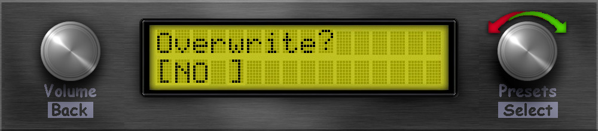

6. If you are really sure, push the preset encoder and the voice is stored.

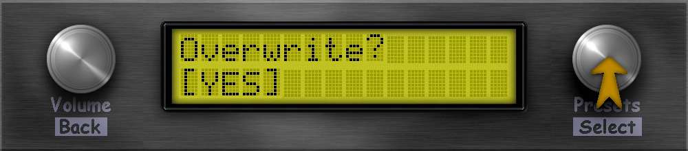

You can always abort the process by pressing the volume encoder (back):

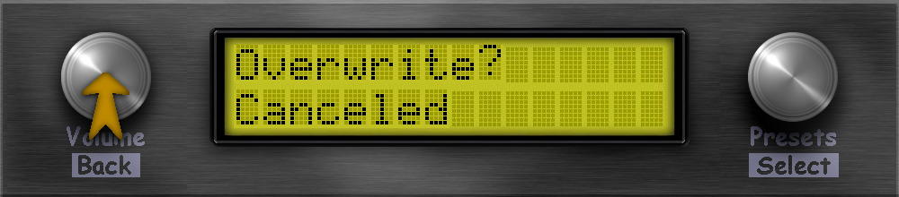

### Load/Save

MD can save additional settings for effects and voice independently from voice/bank presets. Furthermore it is even possible to recall finished combinations of these three variants.

#### Performance

A performance is a combination of an effect setup, voice setup and the selected voices themselves (see below for descriptions of effect setup and voice setup). A performance doesn't store the voice or effect data itself - it stores only references. Different performances can use the same voice or effect configuration. If you modify a voice/effect config it will affect all performances which use this configuration.

Loading and/or saving a performance makes it possible to recall or save a complete setup ready to play for live operation.

---
> __Hint on Performance:__
> It is possible to recall a performance directly via the first used MIDI channel using MIDI Bank Change/MIDI Program Change.
>
> TBD: explain how to do this
---

#### Voice config

Voice configurations store all data beyond the sound data itself that is necessary for playing. Voice configs should not be confused with the voice data (inside a bank) that describes the sound. All data that are not stored in the voice data are stored in a voice config:

* MIDI channel
* MIDI lowest note
* MIDI highest note
* Transpose
* Tune
* Internal level
* Panorama
* Polyphony
* Velocity level
* Engine Type
* Mono/Poly
* Note refresh mode
* Pitchbend:
  * Range
  * Step
* Modulation wheel
  * Range
  * Assign
  * Mode
* Foot controller
  * Range
  * Assign
  * Mode
* Breath Controller
  * Range
  * Assign
  * Mode
* Portamento
  * Mode
  * Glissando
  * Time
* Operator status

#### Effects

Effect configurations save all settings for the effects and are independent of voice configurations or the voices themselves. The following parameters are stored:

* Filter cutoff
* Filter resonance
* Chorus
  * Frequency
  * Waveform
  * Depth
  * Level
* Delay
  * Time
  * Feedback
  * Level
* Reverb
  * Send
  * Roomsize
  * Damping
  * Level
* Equalizer
  * Bass
  * Treble

#### MIDI

The following menu items allow data exchange via MIDI-SYSEX with editors/ librarians or a second MD.

##### MIDI Recv Bank

A bank consists of 32 voices. These can be sent in a block to MD. Before you can send them, you have to select a bank slot and maybe you would like to edit the name of the bank on MD's side.

1. Choose the bank slot.

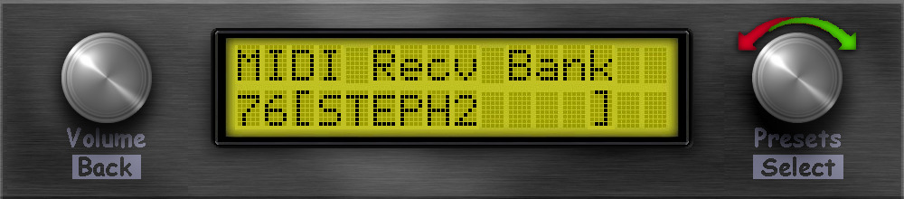

2. After choosing, push the preset encoder.

3. Think about overwriting the selected bank/voice? If it is ok, turn the preset encoder to choose **YES**.

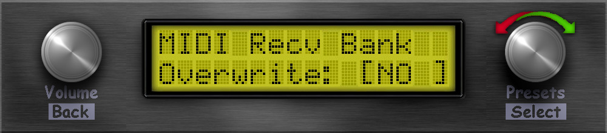

4. If you are really sure, push the preset encoder.

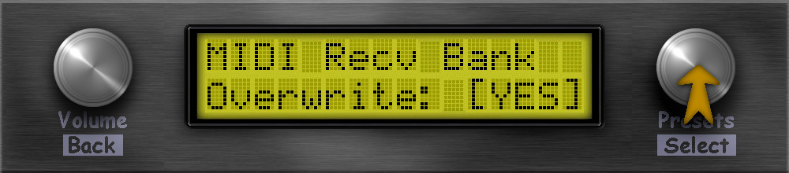

5. Now you can choose to edit the name of the new bank. The blinking cursor is located on the first character (on the left) and can be moved with the preset encoder in this example to the position of character the "4").

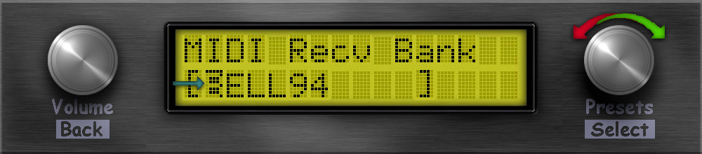

6. At the position where the letter is to be changed, the preset encoder must be pressed to switch to *edit mode*.

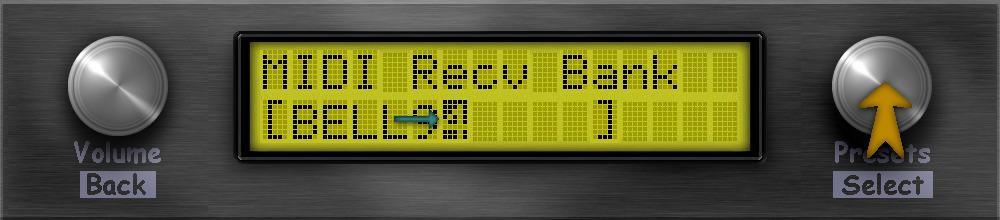

7. After you pressed the preset encoder, you are in *edit mode*. This is indicated by an asterisk at the end of the field. 

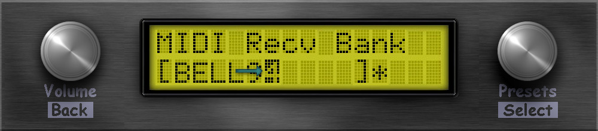

8. Now you can turn the preset encoder up/down to choose the character you need.

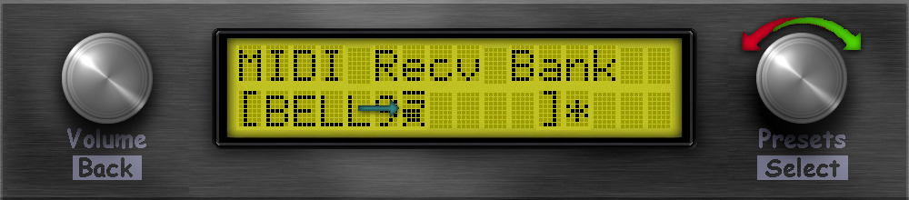

9. With pressing the preset encoder you leave the edit mode (the asterisk disappears).

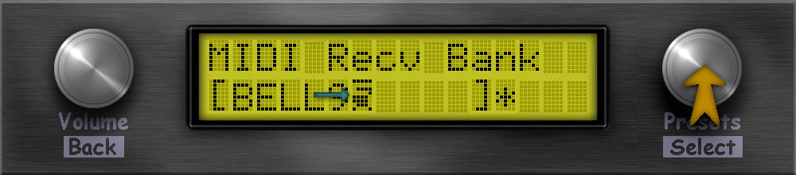

10. Now you can go back to step 5 and edit the other characters like the first one, or you can go one position after the last character to leave the edit screen. An OK prompt will appear on the right.

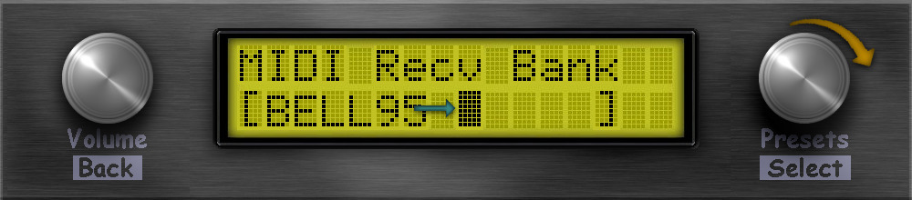

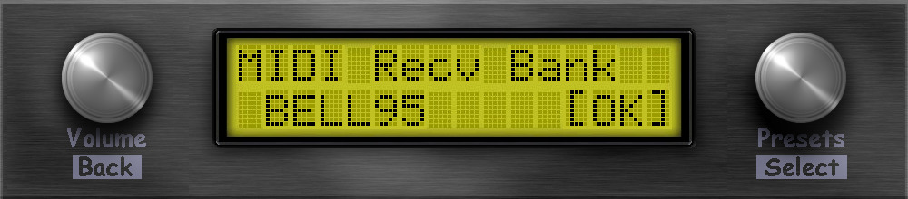

11. Push the preset encoder to wait for the data to receive.

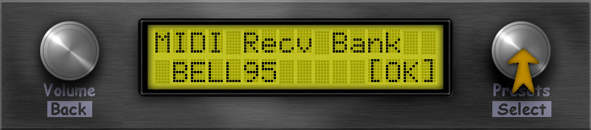

12.  Now you can send the bank data from the remote device. After the transfer is succesful, the data will be stored - not before!

You can always abort the process by pressing the volume encoder (back):

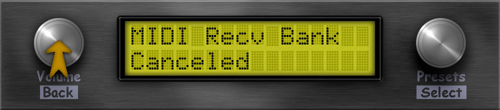

##### MIDI Snd Bank

You can also send a complete bank of 32 voices via MIDI-SYSEX.

1. Choose the bank slot.

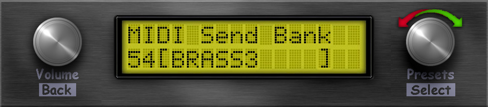

2. After choosing, push the preset encoder.

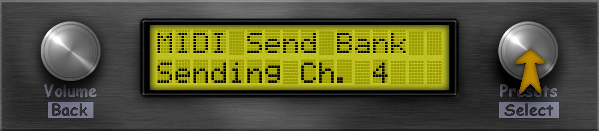

The bank will be sent immediately.

---
> __Hint for sending banks via MIDI:__
> The bank is sent on the configured MIDI channel. If OMNI is configured, then MIDI channel 1 is used for sending.
---

##### MIDI Snd Voice

This is where you can send one voice via MIDI-SYSEX.

1. Choose the bank slot.

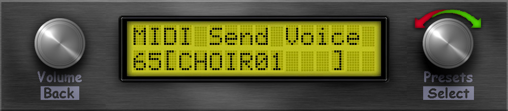

2. After choosing, push the preset encoder.

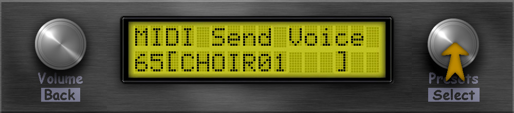

3. Choose the voice slot.

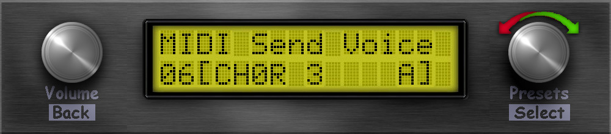

4. After choosing, push the preset encoder.

The voice will be sent immediately.

---
> __Hint for sending banks via MIDI:__
> The voice is sent on the configured MIDI channel. If OMNI is configured, then MIDI channel 1 is used for sending.
---

### System

Everything that belongs to the basic settings and is probably rarely changed can be found in this menu.

#### Stereo/Mono

MD can be operated both in stereo and mono. In addition, the mono signal can also be output on both channels or only on one channel. This is unseful when you want to to use only one cable, but even more, if you want to chain 2 MDs, via Audio IN, and have their outputs separated on 2 different audio channels.

Parameters:
* Stereo/Mono (STEREO/MONO/MONO-R/MONO-L)

#### MIDI Soft THRU

MD has a real MIDI-THRU connection on the TMA circuit board. But if this is not used, it is possible to output all incoming MIDI data via the existing interfaces.

For example, if data arrives via MIDI-DIN it will be output on MIDI-DIN, USB-HOST-MIDI and USB-MIDI (without filtering).

MIDI Soft THRU is also a MIDI merger. When two controllers are plugged into MD, one in the MIDI DIN input, and one on the USB socket, the MIDI messages are merged and sent back to the MIDI DIN output.

---
> __Hint on MIDI Soft THRU:__
> This also works when MIDI data is sent that MD does not process. So you have a simple MIDI media converter (USB-MIDI <-> DIN-MIDI).
---

Parameters:
* MIDI Soft THRU (ON/OFF)
  
#### EEPROM Reset

Resetting the EEPROM can sometimes be necessary if the internal data has been messed up (by a new firmware). By resetting the EEPROM only the current configuration data is overwritten. All bank/voice data and configurations on the SD card are __not__ affected.

### Info

The Info menu states some information about the software version and the SD card.

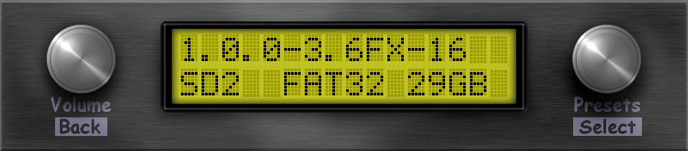

## Tips and tricks

The sound generation (msfa) from the free VST-plugin Dexed. So you can use Dexed as MIDI SYSEX editor or you can use sounds programmed with Dexed on MD. For the original Dexed/msfa software take a look at [Dexed on Github](https://github.com/asb2m10/dexed) and [Music Synthesizer for Android on Github](https://github.com/google/music-synthesizer-for-android).

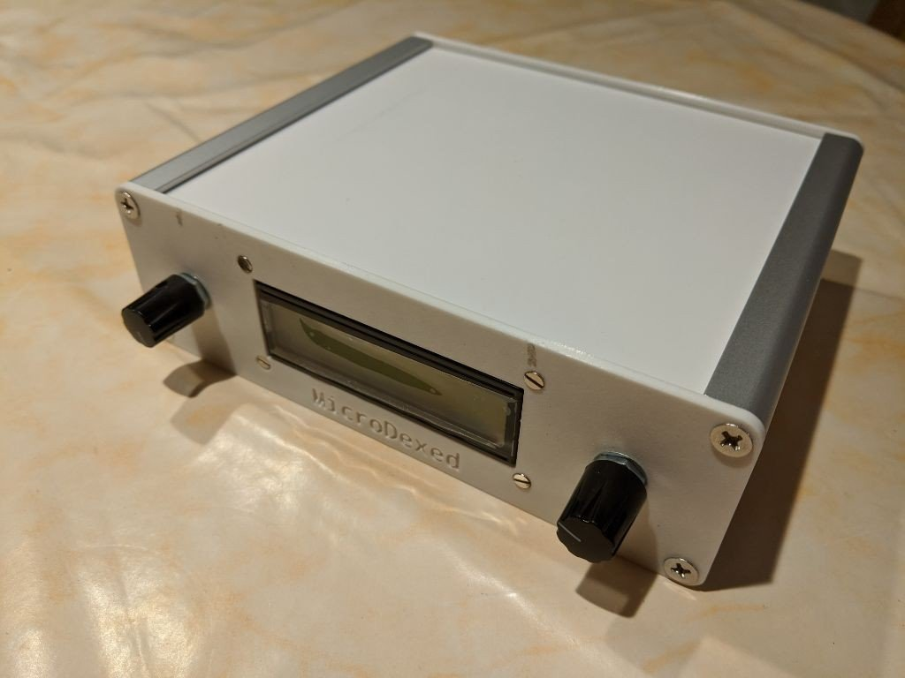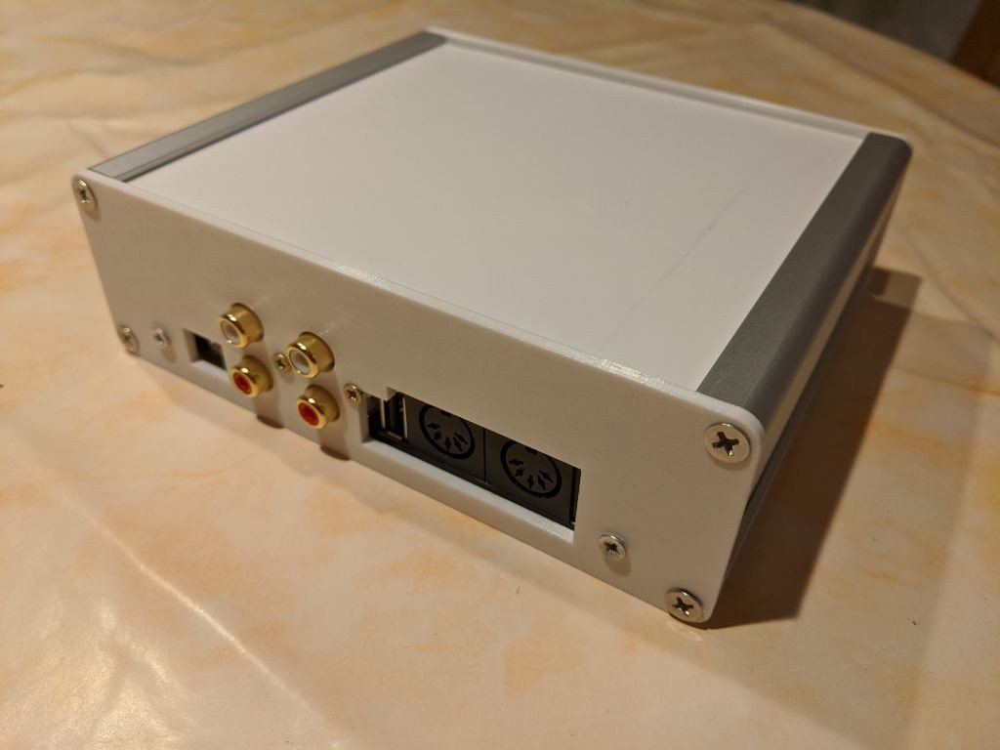

### Editing voice presets

As mentioned before: you can use external editor software for MIDI SYSEX editing of MD voice presets. Here is a collection of freely available editors:

* [https://www.thisdx7cartdoesnotexist.com/](https://www.thisdx7cartdoesnotexist.com/)
  * not really an editor but a system which generates a bank of voice presets with a KI behind. The names of the voice presets are mostly not readable at the time of writing, but the sounds were not bad.
* [https://dx7.vstforx.de/](https://dx7.vstforx.de/)
  * an online editor inside the browser, tested with Google Chrome or Chromium.
* [https://synthmata.com/volca-fm/](https://synthmata.com/volca-fm/)
  * also an online editor whic was written for Volca-FM but also works for Dexed/MD.

Another way of editing voice presets is to use an editor like Edisyn. For download and install instructions read the manual at [https://github.com/eclab/edisyn](https://github.com/eclab/edisyn).

## Menu structure

* Voice
  * Select
    * Audio
      * Voice Level
        * Panorama
        * Effects
          * Chorus
            * Waveform
            * Depth
            * Level
          * Delay
            * Time
            * Feedback
            * Level
          * Filter
            * Cutoff
            * Resonance
          * Reverb
            * Roomsize
            * Damping
            * Level
            * Reverb Send
          * EQ
            * Bass
            * Treble
        * Controller
          * Pitchbend
            * PB Range
            * PB Step
          * Mod Wheel
            * MW Range
            * MW Assign
            * MW Mode
          * Aftertouch
            * AT Range
            * AT Assign
            * AT Mode
          * Foot Ctrl
            * FC Range
            * FC Assign
            * FC Mode
          * Breath Ctrl
            * BC Range
            * BC Assign
            * BC Mode
        * MIDI
          * MIDI Channel
          * Lowest Note
          * Highest Note
          * Send Voice
        * Setup
          * Portamento
            * Port. Mode
            * Port. Gliss
            * Port. Time
          * Polyphony
          * Transpose
          * Fine Tune
          * Mono/Poly
        * Internal
          * Note Refresh
          * Velocity Lvl
          * Engine
        * Operator
        * Save Voice
* Load/Save
  * Performance
    * Load Perf.
    * Save Perf.
  * Voice Config
    * Load Voice Cfg
    * Save Voice Cfg
  * Effects
    * Load Effects Cfg
    * Save Effects Cfg
  * MIDI
    * MIDI Recv Bank
    * MIDI Snd Bank
      * MIDI Snd Voice
* System
  * Stereo/Mono
  * MIDI Soft THRU
  * EEPROM Reset
* Info

## MIDI-Controllers

| MIDI-CC# | Target |
|:--------:|:-------|
| 0        | Bank-Select MSB (currently unused)|
| 1        | Modulation wheel |
| 2        | Breath controller |
| 4        | Foot controller |
| 5        | Portamento time |
| 7        | Volume |
| 10       | Panorama (0-62 = left, 63-64 = middle, 65-127 = right)|
| 32       | Bank-Select LSB|
| 64       | Sustain (0 to 63 = Off, 64 to 127 = On)|
| 65       | Portamento (0 to 63 = Off, 64 to 127 = On)|
| 91       | Reverb send |
| 93       | Chorus level |
| 94       | Tune |
| 103      | Filter resonance |
| 104      | Filter cutoff |
| 105      | Delay time |
| 106      | Delay feedback |
| 107      | Delay volume |
| 120      | MIDI panic |
| 121      | Reset controllers |
| 123      | All notes off |
| 126      | Monophonic mode (0 = Polyphonic, >0 = On)|
| 127      | Polyphonic mode (0 = Mono, >0 = On)|

---
> __Hint on bank and voice selection:__
> If you want to select a new voice preset, you can send a program change command.
>
> To change the bank there are two MIDI CCs (0 and 32), where MIDI CC 0 is currently not used.
>
> So to select a new voice preset you either have to send a program change command (then the bank is not changed) or change with MIDI-CC 32 the bank number followed by a program change for the voice preset number.
---

## Software development

MD is a completely open hardware (TMA board) __and__ open software project. All resources are available at codeberg.org:

  * MicroDexed: [https://codeberg.org/dcoredump/MicroDexed](https://codeberg.org/dcoredump/MicroDexed)
  * TeensyMIDIAudio board: [https://codeberg.org/dcoredump/TeensyMIDIAudio](https://codeberg.org/dcoredump/TeensyMIDIAudio)

Unfortunately there is currently no finished website and no forum. Hopefully this will follow soon.

### Reporting Bugs

MD has errors as there is no error-free software - at least I don't know any. If you find a bug in the program, please open an issue at [https://codeberg.org/dcoredump/MicroDexed/issues](https://codeberg.org/dcoredump/MicroDexed/issues). Please remember to make the error description as accurate as possible and include as much information as possible and possibly MIDI files in the report.

### Feature Requests

Feature requests can currently also be made via [https://codeberg.org/dcoredump/MicroDexed/issues](https://codeberg.org/dcoredump/MicroDexed/issues) . Please mark the title as __Feature-Request__.
